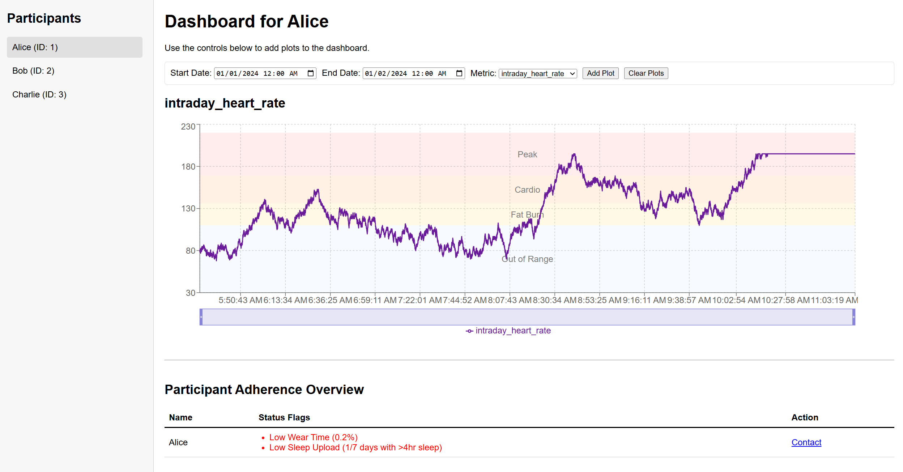
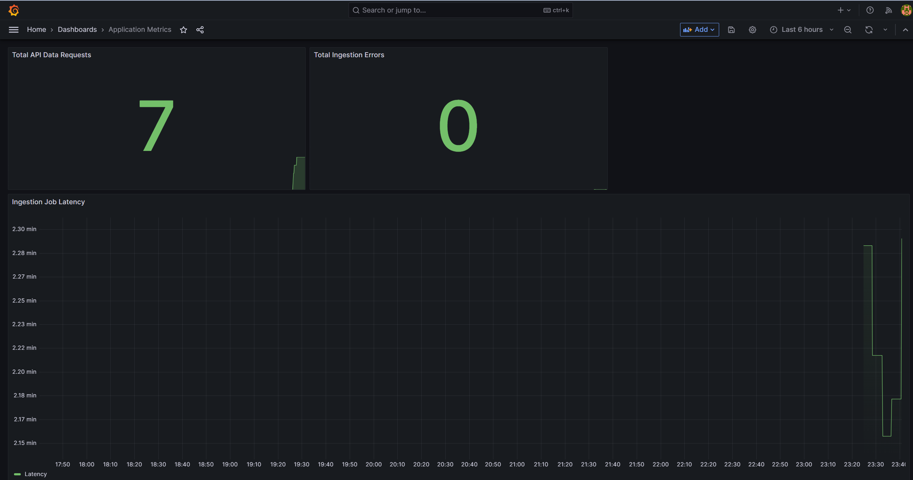
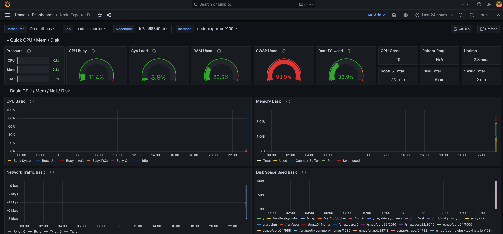
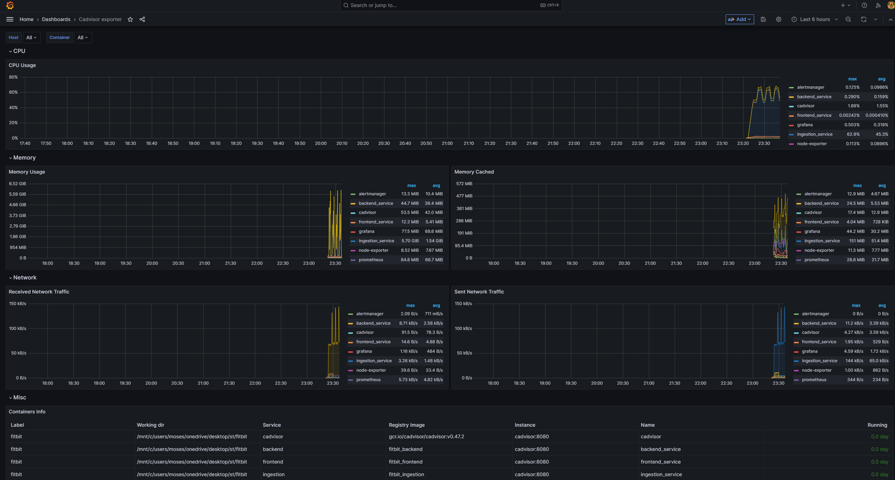

# Fitbit Data Pipeline

## Overview

This project sets up a data pipeline to ingest Fitbit data into a TimescaleDB database using Docker.

# Health Metrics Visualization

# Application Metrics with Grafana

# Host Machine Metrics with Grafana

# Container Metrics with Grafana


Fitbit Challenge Answers:
[Task 0.a](docs/task0.md)

## How to Run
Create a virtual env: python -m venv venv and source venv/bin/activate
1.  **Prerequisites:** Docker and Docker Compose must be installed.
2. npm install (once to generate the package-lock.json)
3. chmod +x cleanup.sh to make the script executable
4.  **Run the service:**
    ```bash
    docker-compose up --build
    ```
This will start the TimescaleDB database and run the ingestion script to load the data
After the frontend and backend are loaded, wait for 2 minutes for the first set of data to get ingested and loaded to the database
Then open http://localhost:3000 to see the dashboard
If needed to restart from the beginning: recommeded to ./cleanup.sh to restart the docker containers and databases from beginning to avoid conflicts

Open Grafana at http://localhost:3001. Log in with username admin and password admin
The visualization options will be available after login and are all automatically loaded without creating any new dashboards


5. run the impute.py script after the ingestion completes and imputation works with TimescaleDB simple interpolation, a advantage of using timescaledb for timeseries data
   **Run the impute service:**
    ```bash
    docker-compose up -d
    docker-compose exec ingestion python3 /app/impute.py
    ```

Some notes:
- currently the application depends completely on wearipedia library's synthetic data and its extensible to incoporate real data
- during the intial setup a user database will be created and three user records will be added to simulate
- the parsing and ingestion works with intraday_heart_rate, intraday_spo2, intraday_activity, azm, sleep, breathing_rate, intraday_hrv and it happens currently for three users with user_ids 1, 2, 3
- ingestion is set to run every 2 minutes and ingests one day's data every 2 minutes. A state file is created automatically on the first day to store the current days ingestion
- aggregates of 1d, 1min, 1hr tables have been created and gets updated regulary as per the scheduler and used to render frontend and data analysis
- pagination/chunking has been implemented when data is requested to frontend for better performance
- impute.py is still under development
- impute.py script should only be run at the end of the complete ingestion for data analysis only, otherwise conflicts can arise as data is getting ingested real time
- 
